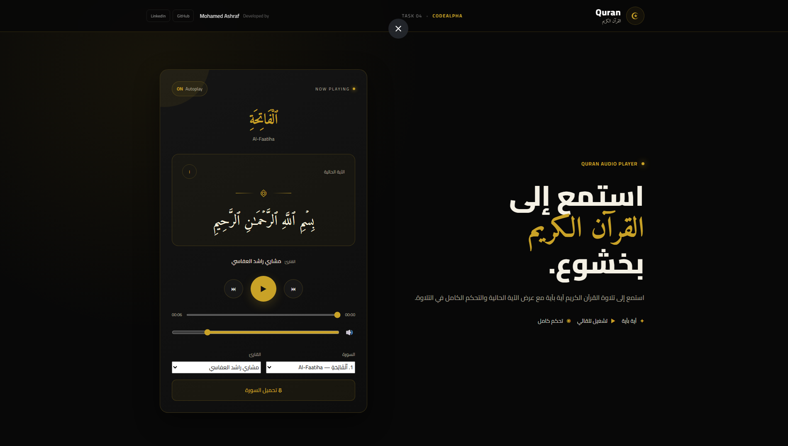

# ☪️ Quran Audio Player

A modern, responsive, and interactive **Quran Audio Player** built with **HTML, CSS, and JavaScript**.

The application allows users to browse all **114 Surahs**, listen to the Quran **Ayah by Ayah**, and view the currently playing Ayah in a clean and user-friendly interface.

## 🌐 Live Demo

🚀 **[View Live Website](https://mohamedashraf-a.github.io/Quran_CodeAlpha/)**

## 📸 Preview

<p align="center">
  
</p>

---

## ✨ Features

* 📖 Browse all **114 Surahs**
* 🎧 Ayah-by-Ayah Quran playback
* 📝 Display the currently playing Ayah
* ▶️ Play / Pause controls
* ⏮️ Previous Ayah
* ⏭️ Next Ayah
* 🔄 Automatic playback between Ayahs
* 🎙️ Multiple Quran reciters
* 🔊 Volume control
* 🔇 Mute / Unmute
* ⏱️ Audio progress and duration
* 📱 Fully responsive design
* 🇸🇦 Arabic RTL interface
* 🌙 Modern and elegant UI
* ⚡ Change Surahs and Ayahs without page reload
* 🎼 Dynamic audio player controls

---

## 🎙️ Available Reciters

The player supports multiple famous Quran reciters, including:

* مشاري راشد العفاسي
* عبد الباسط عبد الصمد
* محمد صديق المنشاوي
* محمود خليل الحصري
* ماهر المعيقلي
* سعود الشريم

---

## 🛠️ Technologies

* **HTML5** — Structure and semantic markup
* **CSS3** — Responsive styling and modern UI
* **JavaScript (ES6+)** — Application logic and audio controls
* **REST API** — Quran data and audio information
* **HTML5 Audio API** — Quran audio playback

---

## 🔗 APIs & Resources

This project uses the following resources:

* [AlQuran Cloud API](https://alquran.cloud/api)
* [Islamic Network Quran Audio CDN](https://cdn.islamic.network/)

---

## ⚙️ How It Works

1. The application loads the available Quran Surahs through the API.
2. Users can select any Surah from the available list.
3. The application retrieves the Surah's Ayahs and audio information.
4. Users can play the selected Ayah using the built-in audio player.
5. When an Ayah finishes, the player can automatically continue to the next Ayah.
6. The currently playing Ayah is highlighted and displayed on the screen.
7. Users can switch between reciters and control the audio volume and playback.

---

## 📱 Responsive Design

The interface is designed to work smoothly across:

* 💻 Desktop
* 📱 Mobile
* 📲 Tablet

The layout adapts to different screen sizes while maintaining an easy-to-use Quran reading and listening experience.

---

## 🎓 CodeAlpha Internship

This project was developed as part of the:

**CodeAlpha — Frontend Development Internship**

### Task 04 — Quran Audio Player

The project demonstrates practical experience with:

* JavaScript DOM manipulation
* REST API integration
* HTML5 Audio API
* Responsive Web Design
* Dynamic UI updates
* Event handling
* Asynchronous JavaScript
* Frontend application structure

---

## 🤍 Sadaqah Jariyah

This project was developed as a **Sadaqah Jariyah for me and my parents**.

May Allah accept it, make it beneficial, and reward everyone who contributes to spreading and benefiting from the Quran. 🤍

---

## 👨‍💻 Developer

**Mohamed Ashraf**

Frontend Developer & Computer Engineering Graduate

* 🐙 **GitHub:** [MohamedAshraf-a](https://github.com/MohamedAshraf-a)
* 💼 **LinkedIn:** [Mohamed Ashraf](https://www.linkedin.com/in/mohamed-ashraf-99b754317/)

---

## 🚀 Getting Started

### 1. Clone the Repository

```bash
git clone https://github.com/MohamedAshraf-a/Quran_CodeAlpha.git
```

### 2. Open the Project

Navigate to the project directory:

```bash
cd Quran_CodeAlpha
```

### 3. Run the Project

Since this is a frontend project, you can open `index.html` directly in your browser or use **VS Code Live Server** for the best development experience.

---

## 📂 Project Structure

```text
Quran_CodeAlpha/
│
├── index.html
├── style.css
├── script.js
├── ui.png
└── README.md
```

---

## 📌 Project Status

✅ Completed

The project is fully functional and deployed using **GitHub Pages**.

---

## ⭐ Support

If you found this project useful or enjoyed the experience, consider giving the repository a ⭐ on GitHub.

---

**Built with ❤️ and JavaScript**

**May the Quran always be a source of guidance, peace, and light. ☪️**
